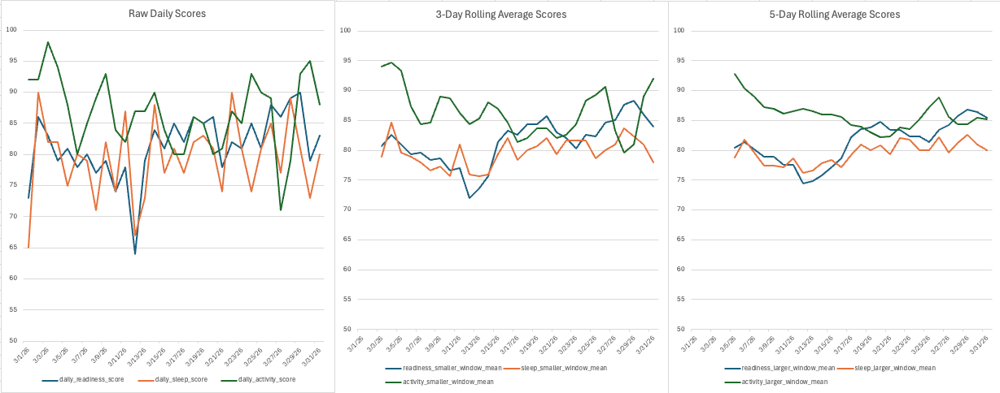

# Continuous Intelligence

## Custom Project

### Dataset
I used a curated day-by-day dataset from my Oura ring covering the month of March 2026. These show a few different daily metrics measured by my ring.

### Signals
This shows scores for my sleep, readiness, and activity on a per-day basis. These signals are an example of the kinds of signals where sample-over-sample variation is expected and okay, but trends that show over multiple successive days start to accumulate into something that moves the needle.

### Experiments
I brought in a new dataset. I ran the dataset with a couple different window sizes to see the effects of various averaging periods. Rather than using two separate files like I did for the example I slotted in the two window sizes side-by-side in the produced artifact.

### Results
The entire process was smooth and streamlined. The results worked as expected. I find these rolling average stories are easier to *see* than to read about:

### Interpretation

What you get from the raw scores (left) is mostly an idea that the dataset is high variability. Successive days (i.e. samples) bounce around all over the place, making it hard to see trends. It's not that presenting raw data is useless, it's that its not as useful when looking for overall trends.

The 3-day rolling average in the middle chart shows some of this variability, but makes the trend more clear.

The 5-day rolling average on the right shows the least variability and the clearest trendlines.

When you first start doing quantified self stuff, you really like to get into the weeds and study the day-by-day data... but after doing it for a long enough time, you start to really only care about the longer-term more global trends.

For my [Data Journal](https://datajournal.guide/Reference-Build/Example-Data-Journal) I find myself monitoring & entering data on the `days` sheet, but spending more time looking at the `quarters` and even `years` sheet in practice.

## Additional Resources

For more on quantified self stuff and seeing how behavior trends over time see my new site:
https://datajournal.guide
